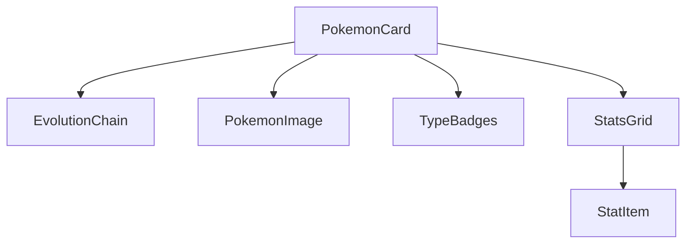

#  React Pokédex 

A high-performance Pokédex web app built with React, featuring advanced memoization, responsive design, and real Pokémon data from [PokeAPI](https://pokeapi.co/).

  
*(Replace with your own GIF/video)*

## ✨ Features

### 🚀 Core Functionality
- **Pokémon Search**: Find any Pokémon by name or ID
- **Shiny Toggle**: Instantly switch between normal/shiny sprites
- **Evolution Chains**: Visualize evolutionary relationships
- **Audio Playback**: Hear authentic Pokémon cries (with volume control)

### 🎮 Gamification
- **Catch/Release System**: Track captured Pokémon in `localStorage`
- **Achievements**: Unlock badges for milestones (e.g., "Shiny Hunter")
- **Team Builder**: Create and share teams of 6 Pokémon

### 📊 Data Depth
- **Type Weaknesses**: Interactive type effectiveness chart
- **Move Lists**: Detailed PP/power/effect information
- **Game Variants**: Alternate forms (Alolan, Galarian, etc.)
- **Stat Radar Charts**: Visualize base stats

## ⚡ Performance Optimizations

### 🔧 Component Architecture


## 🧠 Memoization Strategies

| Technique          | Implementation Example              | Benefit                          |
|--------------------|-------------------------------------|----------------------------------|
| `React.memo`       | All sub-components                  | Prevents unnecessary re-renders  |
| `useMemo`          | Sprite URL generation               | Avoids recomputation             |
| `useCallback`      | Event handlers (playSound, etc.)    | Stable function references       |

## 🌐 Network Resilience

- **3x Auto-Retry** with exponential backoff
- **Offline Detection** with custom UI states
- **Smart Prefetching** of adjacent Pokémon data

## 🛠️ Tech Stack


```text
├── React 18
├── Vite 4.4.1
├── Axios 1.9.0
├── Framer Motion 12.11.0
├── Tailwind CSS (with Glassmorphism)
├── HeroIcons
└── PokeAPI v2
```

## 🚀 Installation

```bash
git clone https://github.com/your-username/pokedex.git
npm install
npm run dev
```
## 🌟 Coming Soon

- [ ] Pokémon comparison tool
- [ ] Breeding information
- [ ] Move simulator
- [ ] Light/Dark Mode
- [ ] PWA support

## 🤝 Contributing

1. **Fork the repository**
2. **Create branch**:
   ```bash
   git checkout -b feature/your-feature
3. **Commit changes**:
   ```bash
   git commit -m 'feat: add amazing feature'
4. **Push**:
   ```bash
   git push origin feature/your-feature
5. **Open Pull Request through GitHub interface**
